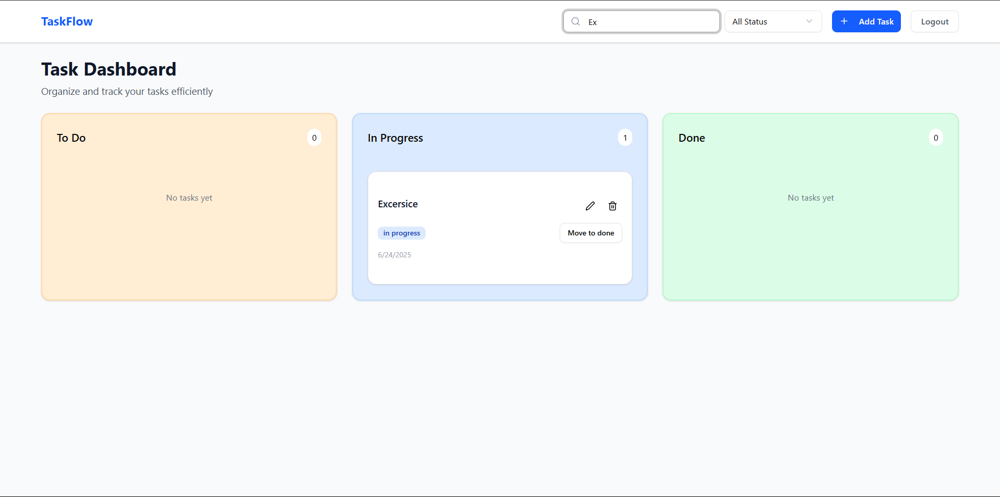

# TaskFlow

A full-stack task management application built with MERN stack.

## Features

- User registration and login (JWT-based)
- Create, edit, delete, and view tasks
- Filter tasks by status and search
- Responsive UI with Tailwind CSS
- Separate frontend and backend deployments

## Tech Stack

- **Frontend:** React, TypeScript, Tailwind CSS, Redux Toolkit
- **Backend:** Node.js, Express, Prisma, PostgreSQL
- **Auth:** JWT (JSON Web Tokens)

## Project Structure
# TaskFlow

A full-stack task management application built with MERN stack.

## Features

- User registration and login (JWT-based)
- Create, edit, delete, and view tasks
- Filter tasks by status and search
- Responsive UI with Tailwind CSS
- Separate frontend and backend deployments

## Tech Stack

- **Frontend:** React, TypeScript, Tailwind CSS, Redux Toolkit
- **Backend:** Node.js, Express, Prisma, PostgreSQL
- **Auth:** JWT (JSON Web Tokens)

## Project Structure

# TaskFlow

A full-stack task management application built with MERN stack.

## Features

- User registration and login (JWT-based)
- Create, edit, delete, and view tasks
- Filter tasks by status and search
- Responsive UI with Tailwind CSS
- Separate frontend and backend deployments

## Tech Stack

- **Frontend:** React, TypeScript, Tailwind CSS, Redux Toolkit
- **Backend:** Node.js, Express, Prisma, PostgreSQL
- **Auth:** JWT (JSON Web Tokens)

## Project Structure
project-root/
    backend/
        controller/
            authController.js
            taskController.js
        middleware/
            auth.js
        prisma/
            schema.prisma
            migrations/
        routes/
            authRoute.js
            taskRoute.js
        index.js
    
    frontend/
        src/
            Components/
                AddTaskDialog.tsx
                Dashboard.tsx
                EditTaskDialog.tsx
                Header.tsx
                ProtectedRoute.tsx
                SearchFilter.tsx
                TaskBoard.tsx
                TaskCard.tsx
                TaskColumn.tsx
            hooks/
                use-toast.ts
                useAppDispatch.ts
                usAppSelector.ts
            Pages/
                Dashboard.tsx
                Index.tsx
                Login.tsx
                Signup.tsx
                NotFound.tsx
            redux/
                store.ts
                Task/
                    taskSlice.ts
            App.tsx
            App.css
            index.css
            main.tsx

## 🧪 Getting Started Locally

### 1. Backend

cd backend
npm install
npm start

### 1. Frontend
cd frontend
npm install
npm run dev

## 📸 Screenshots

### 🔐 Login Page

### Signup Page

### Search Funtionality

### Add Task

### After Login

### All Task

### Filter

### Mobile-login Page

### Mobile-Signup Page

### 📋 Dashboard Page
